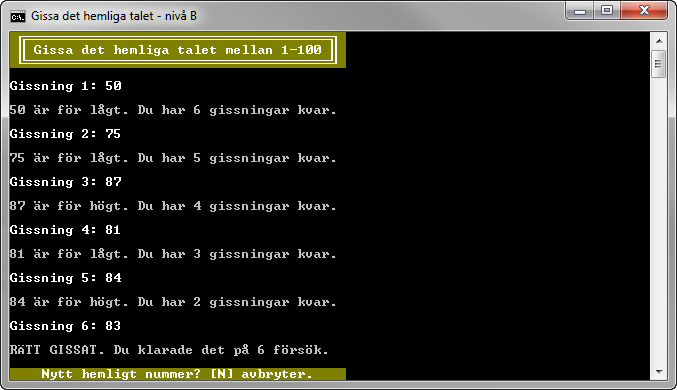

2.1 Gissa det hemliga talet (B-nivå)
====================================
[2-1-gissa-det-hmeliga-talet.pdf](https://github.com/1dv402/kursmaterial/raw/master/Laborationsuppgifter/2-1-gissa-det-hemliga-talet.pdf)

"Skriv färdigt en påbörjad konsolapplikation där användaren ska ha sju försök på sig att gissa ett hemligt tal i det slutna intervallet mellan 1 och 100. Börja med att hämta hem tillhörande projekt..."
